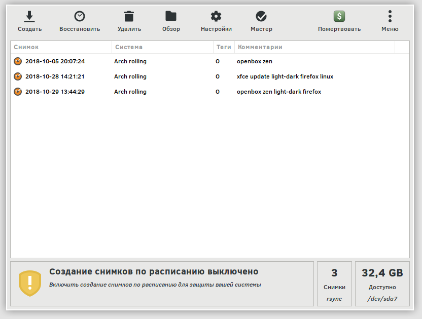
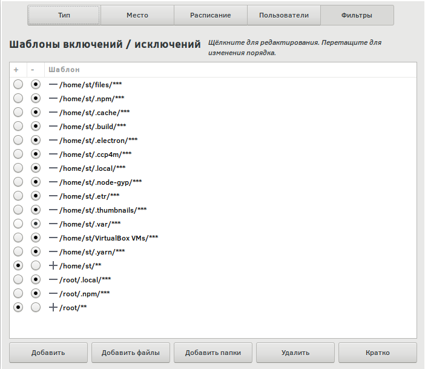

# Apoyo

## Timeshift

Un excelente programa para crear copias de seguridad y restaurar el sistema: **Timeshift**. Esta utilidad crea instantáneas de btrfs y funciona con estándares ext a través de **rsync **. Instalación.



```bash
yay -S timeshift
```

La interfaz es muy sencilla, lo principal es configurar correctamente las excepciones.

Esto es necesario para que no descargue directorios grandes e innecesarios en su sistema. esto ahorra tiempo y espacio en disco al tiempo que mantiene el rendimiento. Como ejemplo, puedo citar el directorio virtualbox, por ejemplo, no lo necesito en la copia del sistema, incluido el disco montado `/home/killer/files`, creo que entiendes la idea.

Aquí está mi lista de reglas. Es importante destacar que las reglas de exclusión deben estar por encima del directorio de inicio, cambiar arrastrando y soltando.



También hay una versión de consola de Timeshift, puede hacer un chroot en su sistema, montar particiones y revertir la versión. Hay ejemplos en la ayuda, todos simplemente `timeshift -h`.

## Rsync


Montamos la partición para la copia de seguridad, primero creamos un directorio.

```bash
mount /dev/sdb1 /dump
```

Copie `/` en `/dump` con una excepción, pero creando los directorios necesarios.

```bash
rsync -avAXHP --delete --delete-excluded --exclude={"/dev/*","/proc/*","/sys/*","/tmp/*","/run/*","/mnt/*","/media/*","/lost+found","/var/lib/pacman/sync/*","/var/cache/*","/var/tmp/*","/boot/*","/home/*"} /* /dump/
```

Copie todo el sistema.

```bash
rsync -avAXHP --delete --delete-excluded --exclude={"/dev/*","/proc/*","/sys/*","/tmp/*","/run/*","/mnt/*","/media/*","/lost+found","/var/lib/pacman/sync/*","/var/cache/*","/var/tmp/*","/home/lost+found","/boot/lost+found"} /* /dump/
```

```bash
rsync -avAXHP --delete --delete-excluded --exclude={"/dev/*","/proc/*","/sys/*","/tmp/*","/run/*","/mnt/*","/media/*","/lost+found","/var/lib/pacman/sync/*","/var/cache/*","/var/tmp/*","/boot/lost+found","/home/lost+found","/home/*/.thumbnails/*","/home/*/.cache/*","/home/*/.local","/home/*/.gvfs/*","/home/*/files/*","/home/*/.var","/home/*/.npm","/home/*/.node-gyp","/home/*/.electron"} /* /run/media/st/dump/myarch/
```

Vale la pena señalar y excluir de `/home`, como en el ejemplo siguiente.

```bash
--exclude={"/home/lost+found","/home/*/.thumbnails/*","/home/*/.cache/mozilla/*","/home/*/.local/share/Trash/*","/home/*/.gvfs/*"}
```

```bash
rsync -avAXHP --delete --delete-excluded --exclude={"/dev/*","/proc/*","/sys/*","/tmp/*","/run/*","/mnt/*","/media/*","/lost+found","/var/lib/pacman/sync/*","/var/cache/*","/var/tmp/*","/boot/lost+found","/home/lost+found","/home/*/.thumbnails/*","/home/*/.cache/mozilla/*","/home/*/.local/share/Trash/*","/home/*/.gvfs/*"} /* /dump/
```

Excluya los directorios donde se montan los discos/particiones, si es necesario.

```bash
/home/st/files
```

A continuación, creamos un archivo.

```bash
cd /dump
tar -caf "/mnt/myarch.tar.xz" /dump/*
```

O gz es más rápido.

```bash
cd /dump
tar -caf "/mnt/myarch.tar" /dump/*
gzip -9 "/mnt/myarch.tar"
```

## Recuperación

Formateamos las particiones necesarias usando gparted o manualmente.

```bash
mkfs.ext4 -L "root" /dev/sda5
mkfs.ext2 -L "boot" /dev/sda2
mkfs.ext4 -L "home" /dev/sda7
mkswap /dev/sda3
```

Arrancamos desde un usb en vivo (o desde este sistema), montamos la partición raíz (dev/sda5), arrancamos, etc., si es necesario.

```bash
mount /dev/sda5 /mnt
mount /dev/sda2 /mnt/boot
mount /dev/sda7 /mnt/home
swapon /dev/sda3

# Cree un directorio y monte la partición con el archivo de respaldo.

mkdir /mnt/dump
mount /dev/sdb1 /mnt/dump
```

Vaya al disco montado (donde lo restauramos), descomprima el archivo.

```bash
cd /mnt
tar xvJf /mnt/dump/myarch.tar.xz -С /mnt
или
tar xvzf /mnt/dump/myarch.tar.gz -С /mnt
```

Entramos en el nuevo sistema.

```bash
arch-chroot /mnt /bin/zsh
```

O.

```bash
chroot /mnt /bin/bash Debian me gusta
```

Editar si es necesario`/etc/fstab`, `/etc/mkinitcpio.conf`, crear imágenes initramfs.

```bash
mv /mnt/etc/fstab /mnt/etc/fstab.bak
genfstab -pU /mnt > /mnt/etc/fstab
```

```bash
mkinitcpio -p linux
```

Configurando claves de pacman.

```bash
pacman-key --init
pacman-key --populate archlinux
```

Actualizar el menú del cargador de arranque es de mala educación, os-prober (para buscar otro sistema operativo).

```bash
pacman -S os-prober
grub-install /dev/sda
grub-mkconfig -o /boot/grub/grub.cfg
```

¡Salga del chroot, desmonte las particiones y reinicie el sistema restaurado!

```bash
umount /mnt/boot
umount /mnt/home
umount /mnt/dump
rmdir /mnt/dump
umount /mnt
```

O.

```bash
umount -R /mnt
reboot
```
