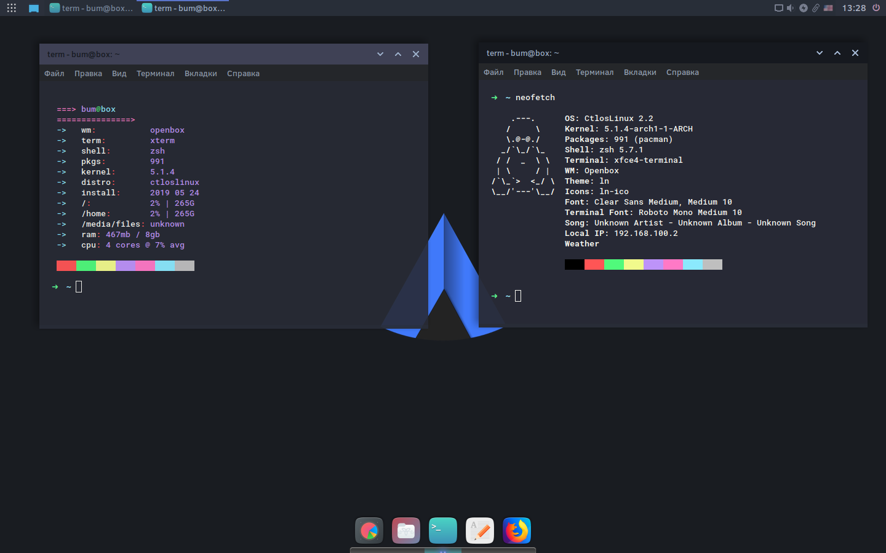

# Релиз Ctlos Linux — Openbox,i3 v2.2

Ядро linux 5.1.4. Тема sddm - darkine. Тема оформления: ln - основа Arc. Иконки ln-ico, ll-ico - основа Suru++. Немного переделал polybar.

Возможность использования polybara в openbox, В `~/.config/openbox/autostart` раскоментить строку `sh ~/.config/polybar/launch.sh &`, а в настройках tint2 переместить панель вниз и закоментить plank в автостарте(по желанию) `plank &`.

## Добавлено (added)

- catfish - поиск файлов.
- gnome-disk-utility
- grub-customizer

## Полный список пакетов

- [packages.both](https://github.com/ctlos/ctlosiso/blob/f230853a492f1c2de4f951f24b99e90ef6ffc7e3/packages.both).
