# Установка Ctlos Linux


## Запись ISO образа на USB накопитель

Для начала нам потребуется установочный ISO образ который можно скачать по ссылке → [Скачать Ctlos Linux](https://Killer-OS-Oficial.github.io/get).

> Важно! Перед началом записи образа, отформатируйте USB накопитель в FAT32, например, используя gparted.

## Программы для записи ISO образов

Linux

Для записи образа в **Linux** потребуется для начала отформатировать Ваш USB накопитель. Сделать это можно следующей командой.

```bash
sudo mkfs.vfat /dev/sdX -I
```
Далее записываем скачанный ранее образ используя утилиту **dd**.

```bash
sudo dd bs=4M if=ctlos.iso of=/dev/sdX status=progress && sync
```

Кросплатформенные инструменты для записи образов (Linux, Windows)

[Etcher](https://etcher.io/ "https://etcher.io/")

Windows

Для записи образа в Windows рекомендуется использовать программу [Rufus](https://rufus.akeo.ie/ "https://rufus.akeo.ie/").

> Внимание! При записи образа в программе Rufus выбирайте режим записи ISO в dd.

## Проверка ISO образа

Проверка контрольных сумм в Windows

Чтобы проверить контрольные суммы в Windows используйте следующую утилиту [MD5 & SHA Checksum Utility](http://raylin.wordpress.com/downloads/md5-sha-1-checksum-utility/).

Проверка контрольных сумм в Linux

Проверка MD5

```bash
md5sum ctlos_xfce_1.0.0_20181102.iso
```

Проверка  SHA256

```bash
sha256sum ctlos_xfce_1.0.0_20181102.iso
```

GPG

```bash
sudo pacman -S gnupg
```

Импорт ключа и проверка образа

```bash
gpg --keyserver keys.gnupg.net --recv-keys 98F76D97B786E6A3
gpg --verify ctlos_xfce_1.0.0_20181102.iso.sig ctlos_xfce_1.0.0_20181102.iso
```

Подробнее о [GnuPG](/wiki/other/gnupg/).

На этом проверка образа закончена. Выше были приведены несколько способов проверки, можете использовать любой, или все сразу.

## Установка

<!-- <div class="embed-responsive embed-responsive-16by9">
  <iframe src="https://www.youtube.com/embed/xaaAoakklfQ" frameborder="0" allow="accelerometer; autoplay; encrypted-media; gyroscope; picture-in-picture" allowfullscreen></iframe>
</div> -->

После успешной записи образа и его загрузки на Вашем устройстве Вы увидите в самом начале раздел выбора языка интерфейса. Выбирайте тот, который Вам удобен. В данном примере будет использоваться русский язык.

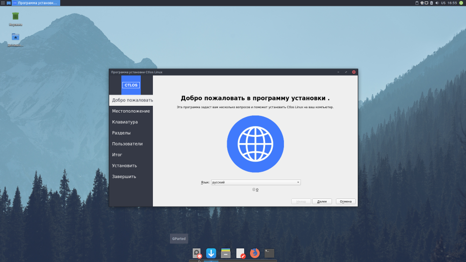

На следующем шаге Вам требуется указать Ваше примерное местоположение для установки и выбора временной зоны.

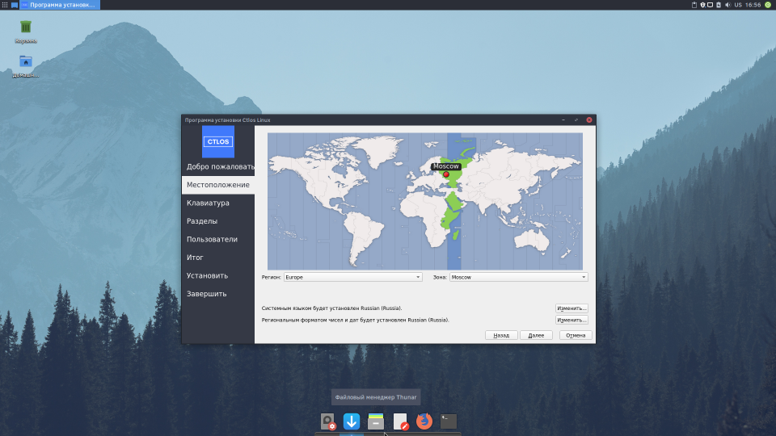

> Внимание! Во избежания дальнейших проблем, на этапе установки выбирайте раскладку **English (US) — По умолчанию**. После установки будет 2 раскладки **ru,us** по **alt+shift**.

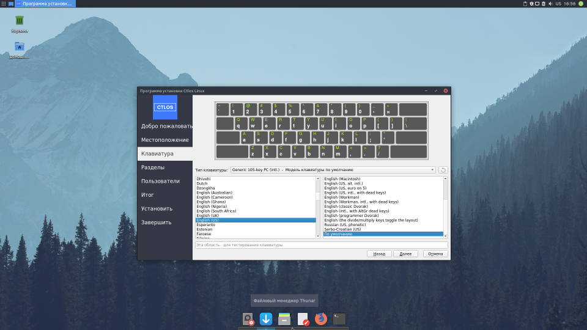

После выбора раскладки Вам требуется разметить диск вручную либо оставить всё как есть.

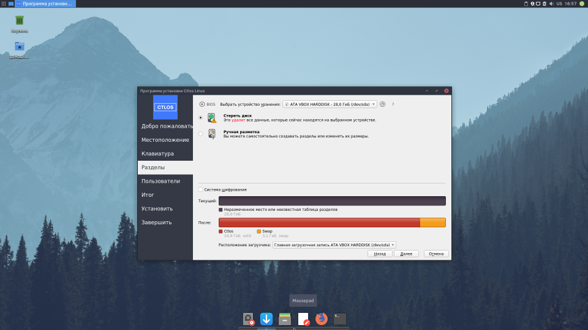

После завершения переразметки диска Вам нужно создать пользователя, выбрать желаемый пароль.

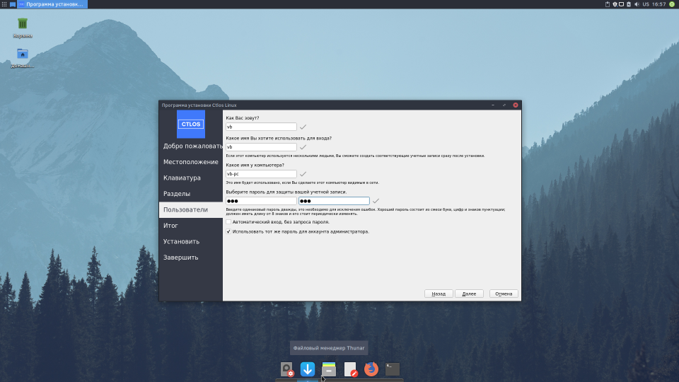

Проверяем данные, можно вернуться и исправить, если что-то не так. Если всё верно - нажимайте "**Установить**".

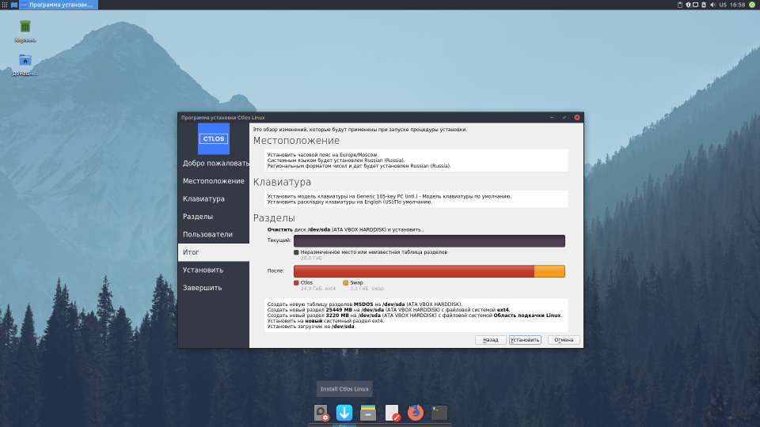

Дождитесь конца установки.

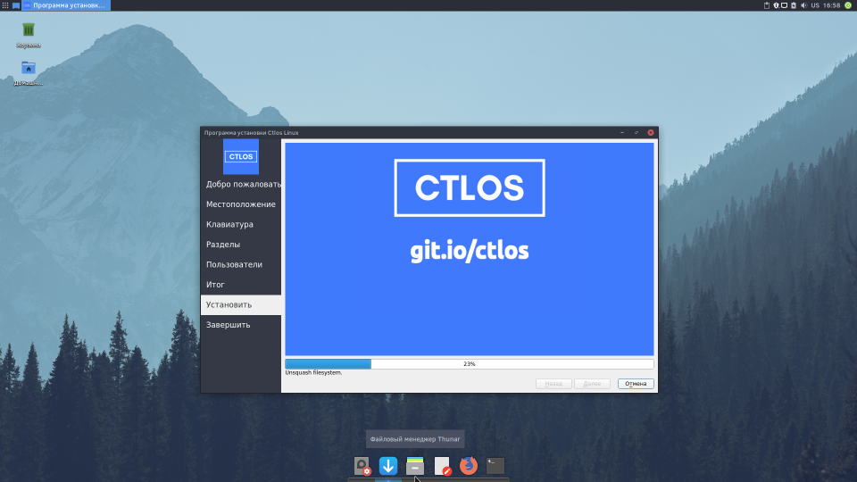

Готово! Теперь Вы можете перезагрузить Ваше устройство.

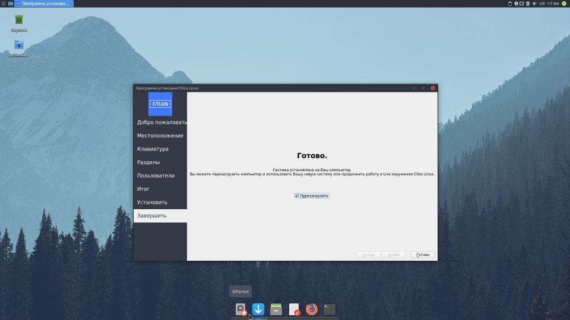

Выбор в меню GRUB.

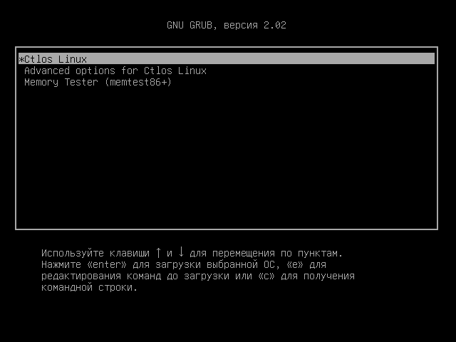

Менеджер входа (используется LightDm), в правом верхнем углу можно выбрать сессию, если присутствуют другие Окружения (DE), или Оконные менеджеры (WM). На данном скриншоте XFCE, она единственная и по умолчанию ничего можно не выбирать.

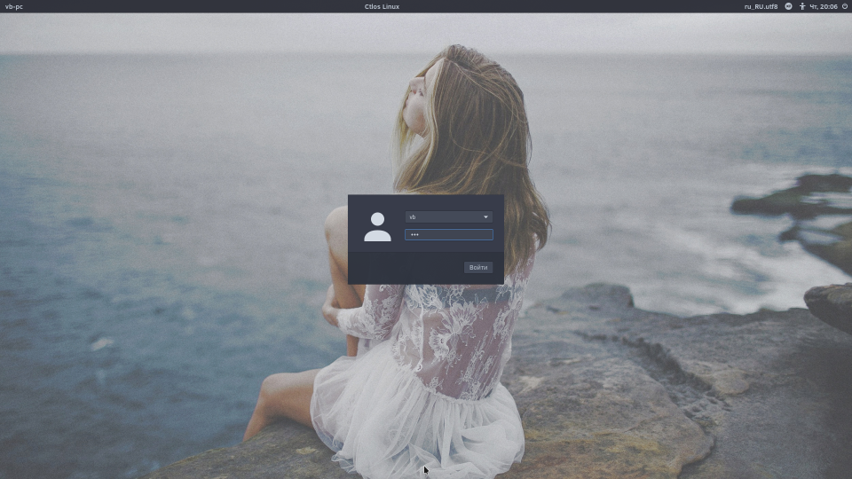

Вот и все! Отдельная благодарность за скриншоты пользователю **breadandbutter** с nnm-club.me

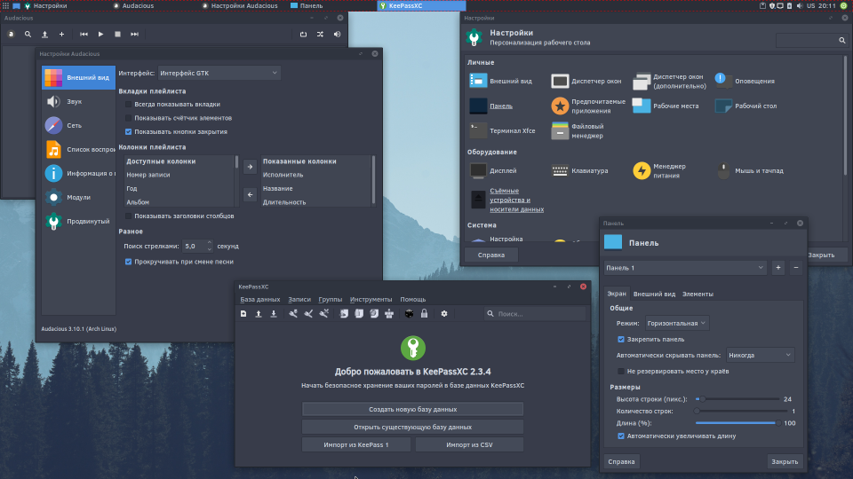
