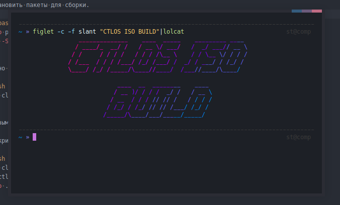

# Создание iso образа



[YouTube link](https://www.youtube.com/watch?list=PLwdYMSK64DT6CCheHMbaqlOzpqfk2FTvT&v=XNpAXthDbrI) Старая версия, но многое объясняет.

## Быстрое создание iso

Установить пакеты для сборки.

```bash
yay -S git arch-install-scripts archiso --noconfirm
```

Первым параметром указываем de/wm, ориентир файл packages.openbox(de/wm). Вторым версию(любую), иначе не отработает.

В скрипте `autobuild.sh` измените переменную `USER`, на ваше имя пользователя `st`.

Измените список пакетов.

- Основные пакеты: packages.x86_64
- Пакеты относяшиеся к openbox: packages.openbox

В `pacman.conf` указан репозиторий [Ctlos repo](https://github.com/ctlos/ctlos_repo), соответственно пакеты беруться и отсюда `x86_64`.

- Конфиги системы в `/airootfs` это будущий корень.
- Конфиги пользователя в `/airootfs/etc/skel`.
- Часть конфигов залетает в систему, через пакеты ctlos, например [openbox-config](https://github.com/ctlos/openbox-config)
- Основной скрипт генерации `/airootfs/root/customize_airootfs.sh`.
- Готовый образ и хэши создаются в данной директории `/out`.

```bash
git clone https://github.com/ctlos/ctlosiso
cd ctlosiso
chmod a+x {autobuild.sh,build.sh}
sudo ./autobuild.sh openbox 1.7.0
```

Можно клонировать определенную ветку, с нужным de/wm (xfce,bspwm).

```bash
git clone -b xfce git@github.com:ctlos/ctlosiso.git
```

Получить удаленную ветку и переключиться на неё.

```bash
git checkout -b bspwm origin/bspwm
```

---

## Создание iso, глубокое вмешательство

### Подготовка к созданию образа

Ctlos Linux 64-bit(x86_64).

Установить пакеты для сборки.

```bash
yay -S git arch-install-scripts archiso --noconfirm
```

Отредактировать файл.

```bash
sudo leafpad /usr/bin/mkarchiso
```

Не обязательно, добавляет подтверждение pacman. В строки ниже добавить ключ -i перед -с, ищите pacstrap, две строки. Сохранить и выйти.

```bash
if [[ "${quiet}" = "y" ]]; then
    pacstrap -C "${pacman_conf}" -i -c -d -G -M "${work_dir}/airootfs" $* &> /dev/null
else
    pacstrap -C "${pacman_conf}" -i -c -d -G -M "${work_dir}/airootfs" $*
fi
```

```bash
mkdir ~/ctlos
cd ~/ctlos
git clone https://github.com/ctlos/ctlos_repo
```

Или ssh.

```bash
git clone git@github.com:ctlos/ctlo_repo.git
```

### Сборка aur пакетов

Найти нужный пакет на сайте аур aur.archlinux.org и загрузить snapshot вида `*.tar.gz`.

Собираем пакеты в `build`.

```bash
mkdir ~/ctlos/ctlos_repo/build
cd ~/ctlos/ctlos_repo/build
wget https://aur.archlinux.org/cgit/aur.git/snapshot/gtk3-mushrooms.tar.gz
```

Распаковываем и собираем пакет.

```bash
tar -xvzf gtk3-mushrooms.tar.gz
cd gtk3-mushrooms
makepkg -s
```

Копируем собраные пакеты в `~/ctlos/ctlos_repo/x86_64`, инициализируем репозиторий. Пакеты в формате `*.pkg.tar.xz`, или `zst`.

```bash
cd ~/ctlos/ctlos_repo/x86_64
repo-add ctlos_repo.db.tar.gz *.tar.xz
```

Или.

```bash
./update.sh
```

После добавления новых пакетов из aur необходимо переинициализировать репозиторий.(Удалить файлы баз данных), или запустить скрипт `update.sh` он сам все пересоздаст.

```bash
repo-add ctlos_repo.db.tar.gz *.tar.xz

repo-add ctlos_repo.db.tar.gz *.pkg.tar.zst
```

Или.

```bash
./update.sh
```

Клонируем репозиторий. Ветка master по умолчанию.

```bash
cd ~/ctlos
git clone https://github.com/ctlos/ctlosiso
```

Или ssh.

```bash
git clone git@github.com:ctlos/ctlosiso.git
```

Можно клонировать определенную ветку, с нужным de/wm (xfce).

```bash
git clone -b xfce git@github.com:ctlos/ctlosiso.git
```

Добавляем пользовательский репозиторий для aur пакетов. В `/ctlos/ctlosiso/pacman.conf`.

```bash
[mainrepo]
SigLevel = Optional TrustAll
Server = file:///home/st/ctlos/ctlos_repo/$arch
```

Закоментировать репозиторий ctlos, если нужно.

```bash
#[ctlos_repo]
#SigLevel = Never
#Server = https://raw.github.com/ctlos/ctlos_repo/master/repo/$arch
```

### Сборка образа

Сделать скрипты исполняемыми.

```bash
cd ctlosiso
chmod a+x {autobuild.sh,build.sh}
```

- Основные пакеты: packages.x86_64
- Пакеты относяшиеся к openbox: packages.openbox

Для создания образа запустить. Первым параметром указываем de/wm, вторым версию(любую), иначе не отработает. В скрипте `autobuild.sh` измените переменную `USER`, на ваше имя пользователя `st`.

```bash
sudo ./autobuild.sh openbox 1.7.0
```

Готовый образ и хэши создаются в данной директории `~/ctlos/ctlosiso/out`.

### Пересборка

Удалить каталоги и запустить скрипт сначала.

```bash
sudo rm -rf {out,work}
```

Или отредактировать.

```bash
nano /bin/pacstrap
```

Изменить строку, для пропуска установленных пакетов.

```bash
if ! pacman -r "$newroot" -Sy "${pacman_args[@]}"; then
```
На.
```bash
if ! pacman -r "$newroot" -Sy --needed "${pacman_args[@]}"; then
```

Удалить файлы блокировки.

```bash
sudo rm -v work/build.make_*
```

Список установленных пакетов в системе. Подробно.

```bash
LANG=C pacman -Sl | awk '/\[installed\]$/ {print $1 "/" $2 "-" $3}' > ~/pkglist.txt

LANG=C pacman -Sl | awk '/\[installed\]$/ {print $2}' > ~/.pkglist.txt
```

Кратко.

```bash
pacman -Qqe > ~/pkglist.txt

pacman -Qqm > ~/aurlist.txt
```

<!-- <div class="embed-responsive embed-responsive-16by9">
  <iframe src="https://www.youtube.com/embed/XNpAXthDbrI" frameborder="0" allow="accelerometer; autoplay; encrypted-media; gyroscope; picture-in-picture" allowfullscreen></iframe>
</div>

<div class="embed-responsive embed-responsive-16by9">
  <iframe src="https://www.youtube.com/embed/SKMQKufbo4M" frameborder="0" allow="accelerometer; autoplay; encrypted-media; gyroscope; picture-in-picture" allowfullscreen></iframe>
</div>

<div class="embed-responsive embed-responsive-16by9">
  <iframe src="https://www.youtube.com/embed/ljRDkQVOlqU" frameborder="0" allow="accelerometer; autoplay; encrypted-media; gyroscope; picture-in-picture" allowfullscreen></iframe>
</div>

<div class="embed-responsive embed-responsive-16by9">
  <iframe src="https://www.youtube.com/embed/b-_dZiyUT8M" frameborder="0" allow="accelerometer; autoplay; encrypted-media; gyroscope; picture-in-picture" allowfullscreen></iframe>
</div> -->
