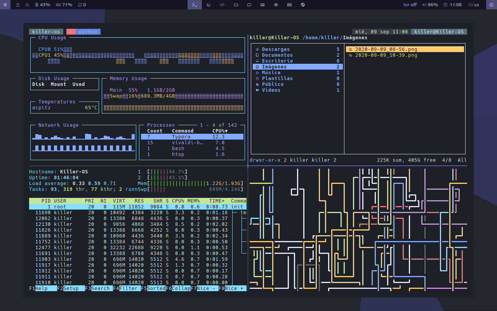

# Killer-OS Linux Bspwm 1.0 Beta

Autor: Killer-Hacker-Oficial [@Killer-hacker-Oficial](https://).

## Descargar imagen iso

- Descargar [Killer-OS Bspwm](/get)
- Descripción de la versión [changelog/bspwm](/wiki/changelog/bspwm-1-0)

Para instalar, el lanzador superior izquierdo en el panel, haga clic derecho - el instalador en el menú. Haga clic izquierdo en rofi y escriba `calamares` Enter.

> Recomendaciones posteriores a la instalación [next-install](#).

Código fuente: [BSPWM](https://github.com/Killer-OS-Oficial/Killer-OS).

## Registro

- Tema gtk: modificado de Qogir.
- Iconos: Qogir-dark, dui-ico.
- Cursor: capitaine-cursors.
- Fuente: Clear Sans Medium,9 `ttf-clear-sans`.
- Fuente terminal: uw-ttyp0, Hack Nerd Font Mono,9 `ttf-nerd-fonts-hack-complete-git`.

## Paneles

### Barra superior, polybar

Los elementos:

- Lanzamiento del menú: click izquierdo - rofi, botón derecho del ratón - jgmenu.
- Urxvt con sesión tmux. La sesión se guarda cuando se cierra y se restaura la próxima vez que se presiona.
- Newsboat - lector de rss.
- Supervise la CPU y la RAM.
- Actualizaciones disponibles, haga clic en: pacui - administrador de paquetes pseudo gráfico.
- Escritorios (etiquetas).
- Servicio de Tor. Habilite el clic izquierdo, deshabilite el derecho.
- Controlador de música mpd.
- Sonido de desplazamiento, haga clic en apagado.
- Fecha. Haga clic izquierdo - más detalles, haga clic derecho - calendario.
- Selección de teclado.
- Menú de salida.

### Barra inferior: bandeja, tinte2

Nombre | Descripción 
--- | ---
udiskie | montaje usb. 
redshift-gtk | tono de color de la pantalla. 
xfce4-power-manager | administrador de alimentación.                               
parcellite | administrador del portapapeles. `ctrl + alt + h` abrir historial. 

## Teclas de acceso rápido

Se han predefinido muchas cosas, pero nadie se molesta en usar el predeterminado, [sxhkdrc](https://github.com/baskerville/bspwm/blob/master/examples/sxhkdrc).

## Gestión de modos y ventanas

- Modo mosaico tiled
- Modo pseudo_tiled, pseudo mosaico. Algo entre flotante y embaldosado.
- Modo flotante.
- Modo de pantalla completa.
- Modo monóculo, la ventana ocupa todo el espacio disponible

Manteniendo presionada 'Super (win)' y las teclas del mouse manipulan las ventanas: tamaño, posición.

Combinación | Descripción 
--- | ---
`super + a` | Pseudo mosaico. 
`super + s` | modo flotante, flotante. 
`super + d` | mosaico. 
`super + f` | pantalla completa. 
`super + m` | Alternar modo monóculo. 
`alt + space` | Alternar modo mosaico/flotante. 
`super + g` | Pega la ventana. 
`super + z` | Cierra una ventana. 
`super + -` | Ocultar/mostrar ventana. 
`super + c` | Cambie al modo monóculo, desactive los bordes y las sangrías. 
`super + v` | Desactiva la sangría. 
`super + {↑,↓}` | Disminuir/aumentar sangrías, `super + c` al estado original. 
`super + scroll` | Disminuir / aumentar sangrías, `super + c` al estado original. 
`super + {←,→,↑,↓}` | Moviendo la ventana en modo flotante. 
`super + {h,j,k,l}` | moverse a través de ventanas en modo de mosaico. 
`super + alt + {h,j,k,l}` | cambiar el tamaño en modo mosaico. 
`super + shift + {h,j,k,l}` | arrastrando en modo mosaico. 
`alt + tab` | Cambiar ventana a la etiqueta actual. 
`super + tab` | Cambia a la etiqueta anterior. 
`super + {1-9,0}` | Ir a la etiqueta (escritorio). 
`super + {q....p}` | Ir a la etiqueta (escritorio). 
`super + alt + {←,→}` | Moviéndose a través de etiquetas (escritorio). 
`super + alt + {1-9,0}` | Enviar ventana al número de etiqueta (escritorio). 
`super + ctrl + p` | Ocultar/mostrar polybar. 

## Utilidades en ejecución

Combinación                   | Descripción 
--- | ---
`alt + shift`          | Cambiar diseños. 
`super + alt + r`      | Reinicie bspwm. 
`super + alt + q`      | Salga de bspwm. 
`super + Escape`       | Vuelva a cargar la configuración de teclas de acceso rápido sxhkd. 
`alt + Return`         | Terminal de conducción, establezca las coordenadas de inicio manteniendo presionado. 
`super + Return`       | Terminal en la primera etiqueta, en modo mosaico, monóculo. 
`alt + t`              | El terminal se abre en modo flotante. 
`alt + r `             | Ranger - administrador de archivos de la consola.            
`alt + d `             | Rofi - menú. 
`alt + w`              | Firefox.
`alt + f`              | Thunar.
`super + Delete`       | Bloqueo de pantalla. 
`super + alt + Delete` | Salir del menú. 
`Print`                | Captura de pantalla con envío a `~/Pictures/screen ` 
`super + Print`        | pantalla en modo de selección.                               
`super + alt + Print`  | pantalla con un retraso de 5 segundos. y enviando a `~/Pictures/screen` 
`super + alt + m`      | Pista actual en ncmpcpp. 
`ctrl + alt + {c,v}`   | Copiar/pegar en la terminal. 

## Archivos de configuración

Archivo | Descripción 
--- | ---
~/.config/bspwm/bspwmrc | Configuración principal                                      
~/.config/bspwm | Scripts. 
/usr/bin/bspwm_start | Script de inicio automático, editar desde `ROOT`. Se llama en `~/.xinitrc` y en SDDM `/usr/share/xsessions/bspwm.desktop`. 
~/.config/sxhkd/sxhkdrc | Configuración de teclas de acceso rápido.                    
/etc/sddm.conf | Configuración del administrador de inicio de sesión SDDM. 
~/.config/bspwm/polybar | Scripts y polybar de configuración. 
~/.config/tint2/tray.tint2rc | Configurar bandeja tint2. Hay un configurador de interfaz gráfica de usuario en el menú (configuración de tint2). 
~/.config/picom.conf | Decorador de ventanas.                                       
~/.Xresources | Configuración del terminal Urxvt. Después de modificar el archivo, ejecute `xrdb -merge $HOME/.Xresources`. 
~/.colors | Paletas de terminales, especificar en `~/.Xresources` línea `#include ".colors/killer'os"`. 
~/.zshrc | Configuración de Shell $SHELL. 
~/.alias_zsh | Alias y funciones de Zsh, abreviaturas de comandos de terminal. 

Esta es la base, todo lo demás está en `~/` y `~/.config`.

## Utilidades

Nobre | Descripción 
--- | ---
neofetch | información sobre el sistema. 
lxappearance, qt5ct | personalización de apariencia.                               
lxrandr | resolución de la pantalla.                                   
gotop | Monitor del sistema de consola. 
gufw | cortafuegos. 
ranger, thunar | administradores de archivos.                                 
fzf | búsqueda incremental, `zz`.                                  
nano, micro | editor de texto de la consola, teclas familiares :) ctrl + s - guardar, ctrl + q - salir, etc. 
leafpad | Editor de texto gui. 
xreader | ver pdf. 
viewnior | visualización de imágenes. 
ncmpcpp, audacious | reproductor de música.                                       
cava | visualizador. 
mpv, smplayer | reproductor de video.                                        
youtube-dl, straw-viewer, streamlink | descargar, ver, ver streaming. 
simplescreenrecorder | Grabación de pantalla.                                       
flameshot | capturas de pantalla.                                        
keepassxc | administrador de contraseñas.                                
veracrypt | cifrado de archivos.                                         
pavucontrol | Control de sonido.                                           
file-roller | administrador de archivos.                                   
timeshift | apoyo.                                                       
tmux | multiplexor terminal.                                        
rxrun.sh | Tmux con 3 pestañas. `~/.bin/rxrun.sh`. 

Más scripts: `~/.bin`.

Lista completa de paquetes: [packages.x86_64](#).